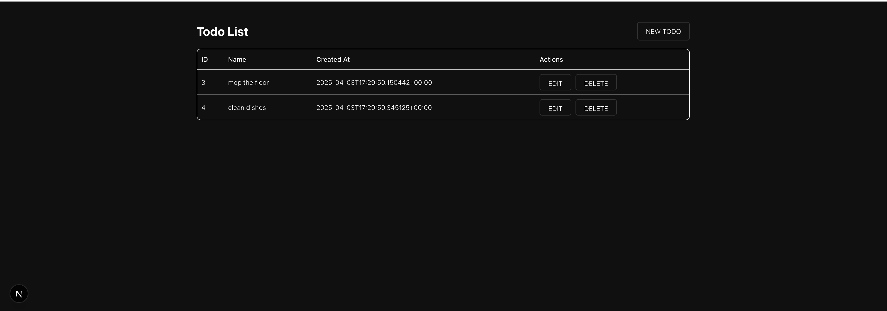

# nextjs-supabase-example

Using an example to learn how to use Supabase with Next.js. Going to aim to build a simple CRUD app.

Technologies I aim to use:
* next js
* supabase
* tailwind css
* typescript
* Shadcn/ui

Create and set the env vars:
```
cp .env.example .env
# Then edit the .env file and add your secrets

source .env
```

## UI

Example of what the UI looks like (CRUD on to do list items):



